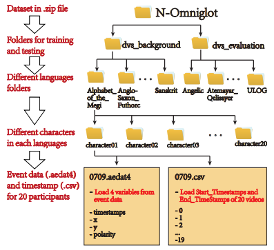
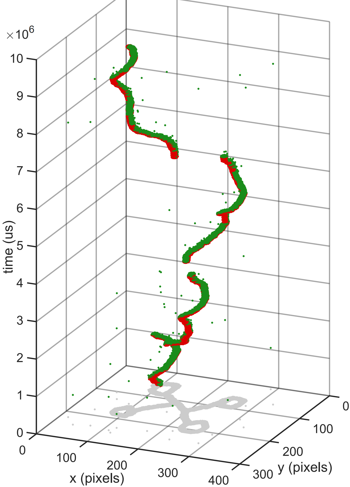
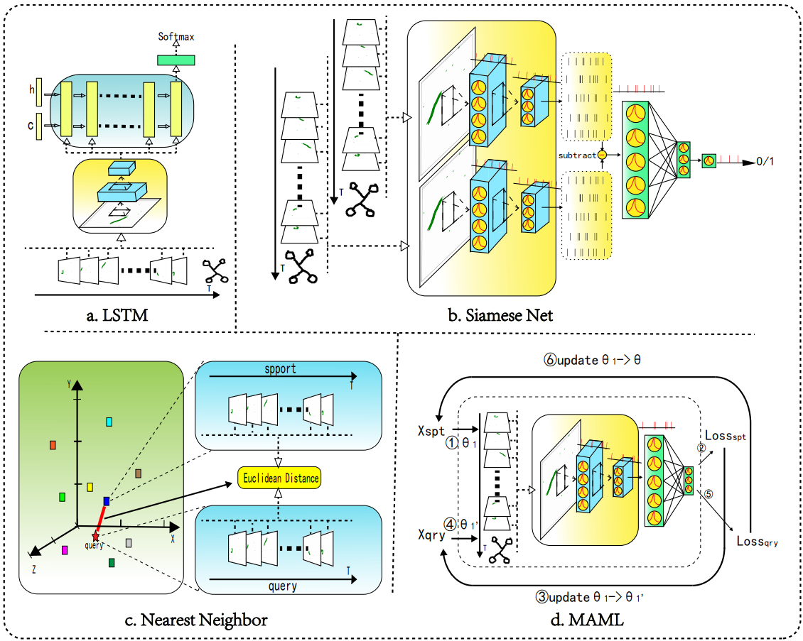

# N-Omniglot

[[Paper]](https://arxiv.org/abs/2112.13230)  || [[Dataset]](https://figshare.com/articles/dataset/N-Omniglot/16821427)

N-Omniglot is a large neuromorphic few-shot learning dataset. It reconstructs strokes of Omniglot as videos and uses Davis346 to capture the writing of the characters. The recordings can be displayed using DV software's playback function (https://inivation.gitlab.io/dv/dv-docs/docs/getting-started.html). N-Omniglot is sparse and has little similarity between frames. It can be used for event-driven pattern recognition, few-shot learning and stroke generation.

It is a neuromorphic event dataset composed of 1623 handwritten characters obtained by the neuromorphic camera Davis346. Each type of character contains handwritten samples of 20 different participants. The file structure and sample can be found in the corresponding PNG files in `samples`. 

**The raw data can be found on the https://doi.org/10.6084/m9.figshare.16821427.**


## Structure




## How to use N-Omniglot

We also provide an interface to this dataset in  `data_loader` so that users can easily access their own applications using Pytorch, Python 3 is recommended.

- NOmniglot.py: basic dataset
- nomniglot_full.py: get full train and test loader, for direct to SCNN
- nomniglot_train_test.py: split train and test loader, for Siamese Net
- nomniglot_nw_ks.py: change into n-way k-shot, for MAML
- utils.py: some functions


As with `DVS-Gesture`, each N-Omniglot raw file contains 20 samples of event information. The `NOmniglot` class first splits N-Omniglot dataset into single sample and stores in the `event_npy` folder for long-term use (reference [SpikingJelly](https://github.com/fangwei123456/spikingjelly)). Later, the event data will be encoded into different event frames according to different parameters. The main parameters include frame number and data type. The event type is used to output the event frame of the operation `OR`, and the float type is used to output the firing  rate of each pixel.

Before you run this code, some packages need to be ready:

    pip install dv
    pip install pandas
    torch
    torchvision >= 0.8.1


- #### use `nomniglot_full`:

```python
db_train = NOmniglotfull('./data/', train=True, frames_num=4, data_type='frequency', thread_num=16)
dataloadertrain = DataLoader(db_train, batch_size=16, shuffle=True, num_workers=16, pin_memory=True)
for x_spt, y_spt, x_qry, y_qry in dataloadertrain:
    print(x_spt.shape)
```


- #### use `nomniglot_pair`:

```python
data_type = 'frequency'
T = 4
trainSet = NOmniglotTrain(root='data/', use_frame=True, frames_num=T, data_type=data_type, use_npz=True, resize=105)
testSet = NOmniglotTest(root='data/', time=1000, way=5, shot=1, use_frame=True, frames_num=T, data_type=data_type, use_npz=True, resize=105)
trainLoader = DataLoader(trainSet, batch_size=48, shuffle=False, num_workers=4)
testLoader = DataLoader(testSet, batch_size=5 * 1, shuffle=False, num_workers=4)
for batch_id, (img1, img2) in enumerate(testLoader, 1):
    # img1.shape [batch, T, 2, H, W]
    print(batch_id)
    break

for batch_id, (img1, img2, label) in enumerate(trainLoader, 1):
    # img1.shape [batch, T, 2, H, W]
    print(batch_id)
    break
```


- #### use `nomniglot_nw_ks`:

```python
db_train = NOmniglotNWayKShot('./data/', n_way=5, k_shot=1, k_query=15,
                                  frames_num=4, data_type='frequency', train=True)
dataloadertrain = DataLoader(db_train, batch_size=16, shuffle=True, num_workers=16, pin_memory=True)
for x_spt, y_spt, x_qry, y_qry in dataloadertrain:
    print(x_spt.shape)
db_train.resampling()
```


## Experiment



We provide four modified SNN-appropriate few-shot learning methods in `examples` to provide a benchmark for N-Omniglot dataset. Different `way`, `shot`, `data_type`, `frames_num` can be choose to run the experiments. You can run a method directly in the `PyCharm` environment


## Reference

[1] Yang Li, Yiting Dong, Dongcheng Zhao, Yi Zeng. N-Omniglot: a Large-scale Neuromorphic Dataset for Spatio-temporal Sparse Few-shot Learning. figshare https://doi.org/10.6084/m9.figshare.16821427.v2 (2021).

[2] Yang Li, Yiting Dong, Dongcheng Zhao, Yi Zeng. N-Omniglot: a Large-scale Neuromorphic Dataset for Spatio-temporal Sparse Few-shot Learning. arXiv preprint arXiv:2112.13230 (2021).
